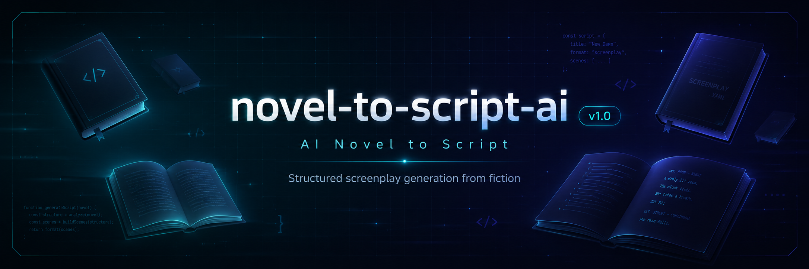

# AI 小说转剧本工具



本项目是一个面向作者的小说改编 Web 工具，用于将 3 个章节以上的小说文本整理为结构化剧本草稿，并以 YAML 格式承载剧本结构。剧本结构优先服务于小说改编，也可作为当下热门的 AI 视频生成剧本、分镜设计和提示词编写的直接参考。

## ✨ 核心能力

- **多章节小说输入**：支持粘贴较长小说文本，并识别中文与英文形式的章节标题。
- **章节数量校验**：要求小说不少于 3 章，空文本、无章节标题或章节不足时会给出清晰提示。
- **结构化剧本生成**：将小说整理为 `script -> chapter -> scene -> beat` 层级。
- **角色与场景整理**：展示角色简介、章节摘要、场景地点、时间范围和场景作用。
- **分镜提示预览**：展示动作、对白、旁白、情绪和转场，并提供镜头与声音建议。
- **YAML 查看与复制**：将结构化剧本对象转换为 YAML 文本，方便保存和继续加工。
- **Schema 文档页面**：展示字段类型、设计原因和结构说明，并支持复制或下载 Schema YAML。
- **本地密钥管理**：服务端读取环境变量，真实 API Key 不会暴露在浏览器前端。

## 🧭 页面入口

| 页面 | 路由 | 功能 |
| --- | --- | --- |
| 首页 | `/` | 展示“开始转换小说”和“查看 YAML Schema”两个主要入口。 |
| 小说转换 | `/convert` | 完成小说输入、章节检查、剧本生成、章节分页预览和 YAML 查看。 |
| Schema 说明 | `/schema` | 查看 Schema 字段说明，并复制或下载 `script.schema.yaml`。 |
| 转换接口 | `/api/convert` | 接收小说文本，在服务端生成结构化剧本草稿和 YAML 文本。 |

## 🚀 快速开始

### 1. 安装依赖

```powershell
npm install
```

### 2. 配置环境变量

项目根目录提供 `.env.example`。本地运行时创建 `.env.local`：

```text
DEEPSEEK_API_KEY=你的 DeepSeek API Key
DEEPSEEK_BASE_URL=https://api.deepseek.com
DEEPSEEK_MODEL=deepseek-v4-flash
MOCK_AI=false
```

如果只想体验页面和转换结果，不调用真实接口：

```text
MOCK_AI=true
```

`.env.local` 已被 `.gitignore` 忽略，请勿将真实 API Key、账号或密码提交到公开仓库。

### 3. 启动项目

```powershell
npm run dev
```

浏览器访问：

```text
http://localhost:3000
```

## 📝 使用流程

1. 从首页点击“开始转换小说”。
2. 粘贴至少 3 个章节的小说文本，或点击“填入示例文本”。
3. 点击“检查章节”，确认章节标题和数量识别正确。
4. 点击“生成剧本草稿”。
5. 查看故事梗概、角色列表、章节、场景和 beats。
6. 使用章节分页按钮切换不同章节。
7. 展开“查看 YAML”，复制生成后的 YAML 文本。
8. 从顶部导航进入 Schema 页面，查看或下载 Schema 文件。

## 🧱 剧本数据结构

```text
script
└── chapters[]
    └── scenes[]
        └── beats[]
```

- `script`：剧本标题、来源类型、语言、故事梗概、角色和章节列表。
- `chapter`：章节标题、章节摘要和场景列表。
- `scene`：场景地点、时间范围、人物、画面风格和剧情作用。
- `beat`：动作、对白、旁白、情绪或转场，以及镜头、声音和时长建议。

完整字段设计见：

- [YAML Schema 文件](schema/script.schema.yaml)
- [Schema 设计说明](docs/schema-design.md)
- [示例剧本 YAML](data/sample-script.yaml)

## 🔌 转换接口

### `POST /api/convert`

请求体：

```json
{
  "novelText": "至少包含三个章节的小说文本"
}
```

成功响应包含：

- `scriptObject`：结构化剧本 JSON 对象。
- `yamlText`：由剧本对象转换得到的 YAML 文本。
- `source`：当前转换数据来源。
- `message`：转换结果提示。

接口会先调用章节解析逻辑。空文本、未识别章节或章节不足 3 个时，不会进入后续转换。

## 🧪 测试与检查

```powershell
npm run lint
npm run build
```

建议手动检查：

1. 空文本应提示先输入小说文本。
2. 没有章节标题的文本应提示使用正确章节格式。
3. 两章文本不能生成剧本草稿。
4. 示例文本应识别到至少 3 章。
5. 转换结果应显示角色、章节、场景、beats、镜头建议和声音建议。
6. Schema 页面应能复制和下载 YAML。
7. 浏览器前端和控制台不应出现真实 API Key。

## 🛠️ 技术栈

- Next.js 15
- React 19
- TypeScript
- Tailwind CSS
- DeepSeek API（OpenAI 兼容格式）
- OpenAI SDK
- js-yaml

## 📁 目录结构

```text
app/          Next.js App Router 页面与服务端接口
components/   小说输入、章节预览、剧本预览和通用布局组件
lib/          章节解析、剧本类型、模型调用和 JSON 处理逻辑
data/         原创示例小说、Mock 剧本与示例 YAML
docs/         Schema 说明和 PR 迭代记录
schema/       YAML Schema 定义
public/       README 横幅等静态资源
```

## 📦 第三方库说明

- `next`：用于构建 Web 应用、App Router 页面和服务端接口。
- `react`、`react-dom`：用于构建交互式页面组件。
- `typescript`：用于提供静态类型约束。
- `tailwindcss`、`postcss`、`autoprefixer`：用于页面样式开发和 CSS 构建。
- `eslint`、`eslint-config-next`、`@eslint/eslintrc`：用于代码规范检查。
- `openai`：用于以 OpenAI 兼容格式调用 DeepSeek API。
- `js-yaml`：用于把结构化剧本 JSON 转换为 YAML 文本。
- `@types/js-yaml`：用于提供 `js-yaml` 的 TypeScript 类型。
- `@types/node`、`@types/react`、`@types/react-dom`：用于提供 Node.js 和 React 类型声明。

## 🔐 安全说明

- DeepSeek 调用只发生在 Next.js 服务端模块和 API Route 中。
- API Key 仅从 `.env.local` 环境变量读取。
- `.env.local`、`.env`、`node_modules/` 和 `.next/` 均不会提交到 Git。
- 请勿在 README、Issue、PR 描述、截图、录屏或聊天记录中展示真实密钥。
- 如果密钥曾被上传到公开仓库，应立即在服务商后台重置并更换。

## 🔧 后续维护方向

- 增加生成结果的 YAML 文件下载。
- 接入 Schema 自动校验并显示字段错误位置。
- 优化不同小说类型的提示词模板。
- 增加生成历史、草稿编辑与本地保存能力。
- 增加单元测试、接口测试和端到端测试。
- 在剧本与分镜结构基础上继续扩展 AI 视频生成工作流。

## 🤖 开发辅助说明

本项目开发过程中使用 AI 工具辅助生成部分代码结构、文档草稿和调试建议，但核心功能设计、代码整合、运行调试和最终提交由本人完成。
